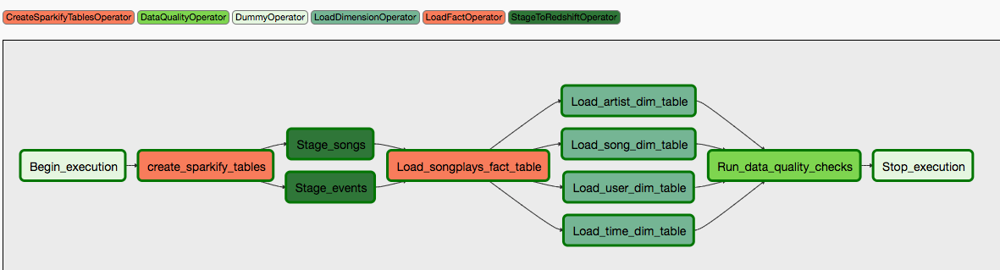

# Data Pipelines with Airflow, Redshift and S3
The main goal of this project is to put into practice all of the new concepts introduced in the Module "Data Pipelines with Airflow" of the Udacity Data Engineer nanodegree program. 

In this case, we assume that there is a company called Sparkify that offers music streaming services and, after collecting data related to the songs that are played by users and the activity of the users when they interact with the application, we want to analyze the data to obtain information about song preferences among users.

## Purpose
Sparkify has 2 main sources of data: logs of user data in JSON format and song information in JSON format. These datasources are stored in different S3 buckets that can be accessed using S3 reading AWS services. For doing this you need to create a role in AWS that has permissions to read from S3.

Because Sparkify has seen an increase in users, the amount of information that they are gathering is growing quickly. So, in order to be able to handle, transform and save this information as the number of user increases, we can use a cloud data warehouse that allows scaling as the data grows. In this project we are going to use Amazon Redshift.

Because users are interacting with the music app on a daily basis, Sparkify needs to build an ETL pipeline that allows to mantain updated the data warehouse. This pipeline should be easy to monitor and configure, so we are using Apache Airflow to build a dag for this ETL pipeline. With Airflow is easier to schedule the pipeline depending on the companies needs. For now is going to be scheduled to be executed every hour.

Because at Sparkify they want to guarantee that all the analysis and insights that come from the dataware house data are accurrate, at the end of the ETL pipeline execution some data quality checks are going to be implemented.

## Project structure

**dags/udac_example_dag.py:** Contains the dag of the Sparkify ETL pipeline
**plugins/helpers:** Contains some helpers to handle and organize SQL create and insert statements
**plugins/operators:** Contains the following custom operators: create_sparkify_tables, stage_redshift,load_fact,load_dimension,run_quality_checks.
**plugins/operators/create_sparkify_tables:** Handles the creation of all of the tables in Redshift, before starting the ETL pipeline
**plugins/operators/stage_redshift:** Connects to S3 and gets the data to be copied to a given table in Redshift
**plugins/operators/load_fact:** Queries a Redshift staging table to extract data and insert it into a given fact table
**plugins/operators/load_dimension:** Queries a Redshift staging table to extract data and insert it into a given dimension table
**plugins/operators/run_quality_checks:** Runs quality checks on the data that was inserted after the ETL pipeline was executed

## Pipeline execution diagram
